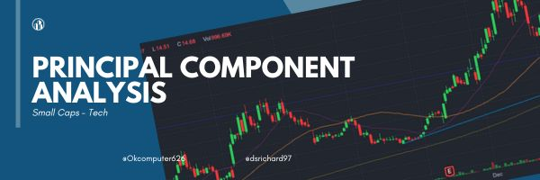
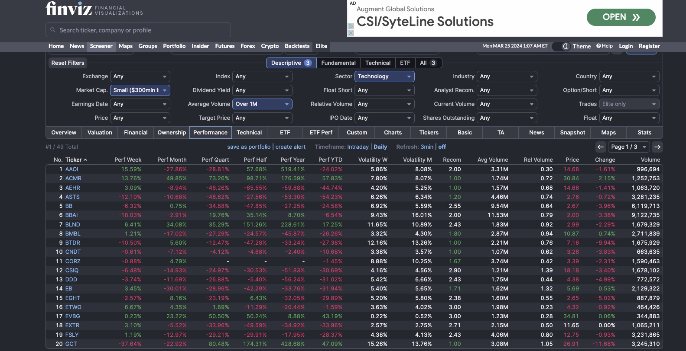
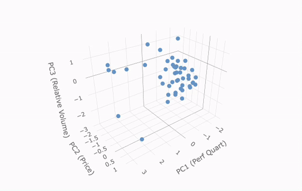

<!DOCTYPE html>
<html lang="en">
<head>
    <meta charset="UTF-8">
</head>
<body>

<!-- Center Banner -->

    
    <h1>Small Cap Principal Component Analysis</h1>

<!-- Badges -->

    
    
    
    

<!-- Authors -->

    <h2>Authors</h2>
    <ul>
        <li><a href="https://github.com/OKcomputer626">@OKcomputer626</a></li>
        <li><a href="https://github.com/dsrichard97">@dsrichard97</a></li>
    </ul>

<!-- Table of Contents -->

    <h2>Table of Contents</h2>
    <ul>
        <li><a href="#getting-started" target="_parent">Getting Started</a></li>
        <li><a href="#data-source">Data Source</a></li>
        <li><a href="#quick-glance">Quick Glance</a></li>
        <li><a href="#steps">Steps</a></li>
        <li><a href="#end-goal">End Goal</a></li>
        <li><a href="#financial-screening">Financial Screening</a></li>
    </ul>

<!-- Content Sections -->

<h2 id="getting-started">Getting Started</h2>
<!-- Content for Getting Started -->
<h3>Motivation:</h3>

Microsoft Q2 2024 Earnings Call Transcript suggested that Azure has been a primary source for increase in Revenue and as a result AMD and NVIDA have been able to accelerate AI. For more detailed information: https://github.com/dsrichard97/SentimentAnalys

<h3>Principal Component Analysis (PCA) - Small Cap</h3>

Principal component analysis (PCA) allows us to summarize and to visualize the information in a data set containing individuals/observations described by multiple inter-correlated quantitative variables. Each variable could be considered as a different dimension. If you have more than 3 variables in your data sets, it could be very difficult to visualize a multi-dimensional hyperspace. In other words, a dimension reduction.

<h3>Focus:</h3>

Be able to generate list that can reduce the best fits three components in Finance in terms of Market Cap, Volatility, Growth Metrics, and Financial Health. Our primary concern is to look at two risk stocks.

<h2 id="data-source">Data Source</h2>
<!-- Content for Data Source -->
<h3 id="financial-screening">Financial Screening - Fin Viz</h3>
<!-- Content for Financial Screening -->
This could involve looking into sub-sectors like software, hardware, cloud computing, semiconductors, etc. We wil use FinViz for market screening. For more information about FinViz: https://finviz.com/screener.ashx?v=141&f=cap_small,sec_technology,sh_avgvol_o1000

<ul>
    <li><strong>Market Capitalization:</strong> Larger companies tend to be less volatile, whereas smaller cap companies can be riskier but offer higher growth potential.</li>
    <li><strong>Volatility:</strong> Look for stocks with higher beta values, indicating higher volatility compared to the market.</li>
    <li><strong>Growth Metrics:</strong> High growth in revenue, earnings, or forecasts can indicate risk but also potential for high returns.</li>
    <li><strong>Financial Health:</strong> Assess the debt levels, cash flow, and profitability ratios. Riskier stocks might operate at a loss or have high debt levels.</li>
</ul>

<!-- Center Banner -->

    

<h2 id="quick-glance">Quick Glance</h2>
<!-- Content for Quick Glance -->

    

<h2 id="steps">Steps</h2>
<!-- Content for Steps -->

For R code: http://rpubs.com/diazrichard98/1167751

<h2 id="end-goal">End Goal</h2>
<!-- Content for End Goal -->

    Used PCA to get the best risky penny stocks. 

</body>
</html>

